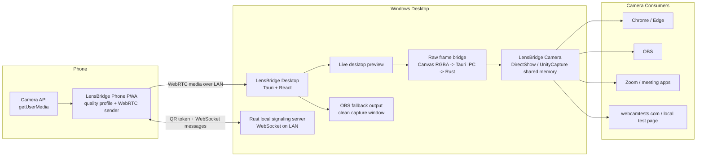

<div align="center">

# LensBridge

**Use your phone as a real Windows webcam over your local network.**

LensBridge is a local-first phone-to-webcam bridge. It pairs a phone with a desktop using a short-lived QR link, streams the phone camera over WebRTC, previews it in the desktop app, and publishes frames to a Windows DirectShow camera named `LensBridge Camera`.

</div>

<div align="center">

[](LICENSE)
[](https://github.com/Abhi190702/lensbridge/actions/workflows/ci.yml)
[](https://github.com/Abhi190702/lensbridge/actions/workflows/rust-check.yml)
[](#windows-directshow-internals)
[](https://tauri.app)

[](https://scorecard.dev/viewer/?uri=github.com/Abhi190702/lensbridge)

</div>

-----

## Overview

LensBridge exists because phones already have better cameras than most laptop webcams, but existing phone-as-webcam tools are often closed, fragile, or awkward to use. LensBridge aims to be an open, understandable baseline:

- Pair from desktop to phone with a QR code.
- Keep signaling and video on the local network by default.
- Stream the phone camera with WebRTC.
- Show a live desktop preview.
- Publish the stream into Windows camera pickers as `LensBridge Camera`.
- Keep OBS available as a fallback, not as the main requirement.
- Avoid accounts, cloud video relays, telemetry, and hidden recording.

The current project is a practical V2 Windows bridge. It is not claiming full cross-platform virtual camera support yet. Windows DirectShow output works through the bundled UnityCapture-based DirectShow filter. macOS CoreMediaIO, Linux v4l2loopback, RTSP ingest, Bluetooth pairing, AI filters, and plugin runtime loading are roadmap items unless explicitly marked implemented below.

-----

## Current Status

| Area | Status | Notes |
| --- | --- | --- |
| Phone camera PWA | Implemented | Mobile browser uses `getUserMedia` and WebRTC. |
| Desktop app | Implemented | Tauri v2, React, Rust local services. |
| QR pairing | Implemented | Random token, local host, local signaling URL, 10-minute pairing TTL. |
| Local signaling | Implemented | Rust WebSocket server on the desktop LAN IP. |
| Desktop preview | Implemented | WebRTC receiver renders the phone stream in the app. |
| Windows camera output | Implemented, experimental | DirectShow device named `LensBridge Camera`. |
| OBS fallback output | Implemented | Clean capture surface for OBS Window Capture. |
| Direct frame transport | Implemented | Raw Tauri IPC frame payload, latest-frame transport, no base64 path in the active bridge. |
| Phone quality caps | Implemented | 540p/720p/360p profiles to avoid wasteful 4K phone capture. |
| Native macOS camera | Planned | Not implemented. |
| Native Linux camera | Planned | v4l2loopback path is planned. |
| AI background blur / autoframe | Scaffolded | Not production behavior yet. |
| Plugin runtime | Scaffolded | Types/docs exist; runtime loading is future work. |

-----

## What "Pairing Link Expires" Means

The countdown in the desktop app is a security timer for the QR/link, not a webcam time limit.

Current behavior:

- A desktop pairing session is created with a random `sessionId` and `token`.
- That pairing token is valid for 10 minutes.
- The token is checked when the phone opens the signaling WebSocket.
- If the countdown reaches `0:00` before the phone connects, click **Regenerate session** and scan the new QR.
- If the phone is already connected and streaming, LensBridge does not intentionally stop the stream at 10 minutes.
- If you disconnect, refresh the phone page, restart the desktop app, or reconnect after the old token expires, you need a fresh QR/link.

So "scan once" means once for the current active pairing. Permanent trusted-device pairing is planned, but it is not implemented yet.

-----

## Architecture View



### Runtime Flow

1. Desktop starts a local signaling server and creates a pairing payload.
2. Desktop renders a QR code containing the phone URL, LAN host, signaling port, session ID, and token.
3. Phone opens the PWA, reads the payload, asks for camera permission, and connects to the desktop signaling socket.
4. Phone and desktop exchange WebRTC offer/answer/candidates through the local signaling server.
5. Phone sends camera frames over WebRTC.
6. Desktop previews the stream.
7. Desktop draws the latest preview frame into a fixed 1280x720 DirectShow output canvas.
8. The active bridge sends raw RGBA bytes to Rust through Tauri raw IPC.
9. Rust validates the frame size and writes it into UnityCapture-compatible Windows shared-memory objects.
10. Windows apps open `LensBridge Camera` from the normal camera picker.

### Windows DirectShow Internals

LensBridge uses a UnityCapture-compatible DirectShow filter for the current Windows camera output. The receiver side uses named Windows shared-memory objects and synchronization handles, not a named pipe:

- `UnityCapture_Mutx*` mutex
- `UnityCapture_Want*` event
- `UnityCapture_Sent*` event
- `UnityCapture_Data*` shared memory block

The desktop app publishes RGBA frames to those shared-memory slots only when a camera consumer opens `LensBridge Camera`.

-----

## Repository Layout

```text
apps/desktop        Tauri v2 desktop app, React UI, Rust signaling and native bridge
apps/phone          Mobile-first phone camera PWA
apps/landing        Landing-page scaffold
packages/shared     Shared TypeScript protocol, pairing, quality, and validation types
packages/protocol   Wire protocol documentation
packages/plugin-sdk Future plugin SDK types
drivers/windows     DirectShow driver install/uninstall scripts and DLLs
drivers/linux       Planned v4l2loopback documentation/scripts
drivers/macos       Planned CoreMediaIO documentation
docs                Architecture, setup, security, OBS, and source-driver docs
examples            Example plugin/source concepts
scripts             Utility scripts
```

-----

## Installation And Setup

<details>
<summary><strong>Requirements</strong></summary>

- Windows 10/11 for the current DirectShow camera output.
- Node.js 22 recommended.
- pnpm 11.3.0 or compatible.
- Rust stable.
- Microsoft Edge WebView2 runtime, normally already present on Windows 10/11.
- Microsoft Visual C++ 2015-2022 Redistributable for Windows driver registration.
- Administrator PowerShell for installing or uninstalling the DirectShow camera driver.

</details>

<details>
<summary><strong>Clone And Install</strong></summary>

```powershell
git clone https://github.com/Abhi190702/lensbridge.git
cd lensbridge
pnpm install
pnpm --filter @lensbridge/shared build
```

If you already have the repo:

```powershell
cd C:\Users\abhij\OneDrive\Desktop\lensbridge
git pull
pnpm install
pnpm --filter @lensbridge/shared build
```

</details>

<details>
<summary><strong>Run In Development</strong></summary>

Open two PowerShell windows.

Terminal 1, phone PWA:

```powershell
cd C:\Users\abhij\OneDrive\Desktop\lensbridge
pnpm dev:phone
```

Terminal 2, desktop app:

```powershell
cd C:\Users\abhij\OneDrive\Desktop\lensbridge
pnpm dev:desktop
```

Keep both running. The desktop QR currently points the phone to the phone dev server on port `5174`.

</details>

<details>
<summary><strong>Install The Windows Camera Driver</strong></summary>

Run PowerShell as Administrator:

```powershell
cd C:\Users\abhij\OneDrive\Desktop\lensbridge
pnpm install:windows-camera
```

Then restart Chrome, Edge, OBS, Zoom, or any app that had already opened its camera list.

To uninstall:

```powershell
cd C:\Users\abhij\OneDrive\Desktop\lensbridge
pnpm uninstall:windows-camera
```

If registration fails:

- Confirm PowerShell is running as Administrator.
- Install Microsoft Visual C++ 2015-2022 Redistributable, both x64 and x86 if needed.
- Make sure the DLL is not blocked by Windows:

```powershell
Unblock-File -LiteralPath "C:\Users\abhij\OneDrive\Desktop\lensbridge\drivers\windows\UnityCaptureFilter64.dll"
```

</details>

-----

## Use LensBridge As A Webcam

### Primary Windows Path

```text
Phone camera -> WebRTC -> LensBridge Desktop -> LensBridge Camera -> Chrome / OBS / Zoom
```

Steps:

1. Install the Windows camera driver once with `pnpm install:windows-camera`.
2. Start the phone PWA with `pnpm dev:phone`.
3. Start the desktop app with `pnpm dev:desktop`.
4. Scan the desktop QR from your phone.
5. Allow camera access on the phone.
6. Wait for the desktop preview to show the phone stream.
7. Open the target app.
8. Select `LensBridge Camera` from the camera picker.

### OBS Fallback Path

```text
Phone camera -> LensBridge Desktop -> OBS fallback view -> OBS Window Capture -> OBS Virtual Camera
```

Use this only if a target app refuses the DirectShow camera or if you want OBS filters/scenes. The fallback view is capture-safe and hides the sidebar, QR card, topbar, status bar, and controls.

-----

## Quality And Latency

LensBridge now avoids the old high-cost frame path. The active Windows bridge no longer sends base64 frame strings through JSON IPC. The current path is:

```text
RGBA canvas frame -> Uint8Array -> Tauri raw IPC -> Rust -> UnityCapture shared memory
```

The frame pump is decoupled:

- Capture runs continuously from the latest WebRTC video frame.
- Transport sends one frame at a time.
- If transport is busy, stale frames are dropped.
- The next send uses the newest available frame.

Default phone quality profiles:

| Profile | Resolution | FPS | Intended use |
| --- | ---: | ---: | --- |
| Low Latency | 960x540 | 30 | Best responsiveness on weak Wi-Fi. |
| Balanced | 1280x720 | 30 | Recommended default. |
| High Quality | 1280x720 | 30 | Higher bitrate 720p. |
| Battery Saver | 640x360 | 24 | Lower heat and power use. |
| Custom | 1280x720 | 30 | Placeholder for future custom UI. |

If a website reports `3840x2160`, that may be the camera mode requested by the browser/DirectShow negotiation. The phone capture and LensBridge transport are still capped by the profiles above.

-----

## Testing

### Quick Manual Test

1. Start `pnpm dev:phone`.
2. Start `pnpm dev:desktop`.
3. Connect the phone.
4. Open `TEST-CAMERAS.html` in Chrome.
5. Click **Scan cameras**.
6. Select `LensBridge Camera`.
7. Click **Allow** in Chrome.
8. Confirm the live phone stream appears.

### Automated Checks

```powershell
pnpm --filter @lensbridge/shared typecheck
pnpm --filter @lensbridge/phone typecheck
pnpm --filter @lensbridge/desktop typecheck
pnpm --filter @lensbridge/phone test
pnpm --filter @lensbridge/phone build
pnpm --filter @lensbridge/desktop build
pnpm check:rust
```

Full workspace checks:

```powershell
pnpm typecheck
pnpm test
pnpm build
```

-----

## Troubleshooting

<details>
<summary><strong>The desktop says "Connection failed"</strong></summary>

Most common causes:

- The phone dev server is not running on port `5174`.
- Phone and desktop are not on the same Wi-Fi/network.
- Windows Firewall blocked the desktop or phone dev server.
- The QR/link expired before the phone connected.
- Desktop restarted and generated a new token.

Fix:

1. Keep both `pnpm dev:phone` and `pnpm dev:desktop` running.
2. Click **Regenerate session**.
3. Scan the new QR.
4. Make sure the phone can open `http://<desktop-lan-ip>:5174`.

</details>

<details>
<summary><strong>I see the QR countdown and worry it stops after 10 minutes</strong></summary>

It does not stop an active stream. The countdown protects the pairing link before connection. After the phone connects, your active WebRTC stream continues until you stop it, close the page, disconnect, or restart the app.

</details>

<details>
<summary><strong>Chrome shows "Unnamed camera"</strong></summary>

Chrome hides camera names until camera permission is granted. Click **Allow this time** or **Allow while visiting the site**, then scan/select again.

</details>

<details>
<summary><strong>LensBridge Camera appears but shows black/green/noisy video</strong></summary>

Try this sequence:

1. Keep LensBridge Desktop open.
2. Keep the phone connected and preview visible in LensBridge Desktop.
3. Restart Chrome or the target app.
4. Select `LensBridge Camera` again.
5. Wait a few seconds after opening the camera; the shared-memory receiver initializes only after a consumer opens the device.

</details>

<details>
<summary><strong>The video feels laggy</strong></summary>

Use `Balanced` first. If Wi-Fi is weak, use `Low Latency`. Keep the phone close to the router, avoid mobile hotspot congestion, close other camera apps, and do not request 4K in target apps when a lower mode is available.

</details>

<details>
<summary><strong>The driver install fails with regsvr32</strong></summary>

Check:

- PowerShell is Administrator.
- Visual C++ 2015-2022 Redistributable is installed.
- The DLL is unblocked with `Unblock-File`.
- The repo is fully synced locally; OneDrive cloud-only files cannot be registered.

</details>

-----

## Security Model

LensBridge is local-first.

What it processes:

- Phone camera frames in the phone browser.
- WebRTC media between phone and desktop.
- Pairing metadata: desktop host, port, session ID, token, expiry.

What it does not do by default:

- No accounts.
- No telemetry.
- No cloud video relay.
- No automatic recording.
- No persistent connection history.
- No background camera capture after you close/stop the phone page.

Current protections:

- Random session IDs and tokens.
- 10-minute pairing token TTL.
- One current pairing payload per desktop runtime.
- Local network signaling by default.
- Driver install/uninstall scripts are explicit and require admin rights.

Current limitations:

- The development phone page is served over plain HTTP for local testing.
- The local WebSocket signaling path is not WSS in dev mode.
- Anyone on the same trusted LAN who obtains the active QR/link before expiry can try to pair.

Planned hardening:

- HTTPS/WSS local setup with mkcert or equivalent.
- Trusted-device persistence.
- Pairing confirmation prompts.
- Optional PIN/passphrase pairing.
- Better firewall/setup diagnostics.
- Release signing and provenance hardening.

See [docs/security.md](docs/security.md) and [SECURITY.md](SECURITY.md).

-----

## Roadmap

### V2.x - Stabilize The Windows Webcam Path

- Keep reducing latency in the DirectShow output path.
- Add clearer diagnostics for firewall, driver, and phone connection failures.
- Improve camera mode negotiation so target apps prefer 720p/30 by default.
- Add trusted-device pairing so repeat scans are less frequent.
- Package a cleaner Windows installer.

### V3 - More Sources And Native Performance

- RTSP/IP camera ingest.
- Another desktop or laptop as a source.
- Screen capture source.
- OBS source ingest.
- Raspberry Pi camera source.
- Native receiver work that avoids WebView canvas readback where possible.
- Linux `v4l2loopback` pipeline.
- Further Windows Media Foundation research without claiming support before it works.

### V4 - Local AI And Plugins

- Local background blur.
- Auto-framing.
- Low-light enhancement.
- Video denoise.
- Plugin runtime loading.
- Source-driver marketplace docs.
- Filter pipeline SDK.

### Not Claimed Yet

- Native macOS CoreMediaIO camera.
- Production-signed Windows Media Foundation camera.
- Bluetooth video transport.
- TURN/cloud relay by default.
- Production virtual microphone.
- AI filters as completed product features.

-----

## Development Notes

The monorepo uses pnpm workspaces:

```powershell
pnpm install
pnpm --filter @lensbridge/shared build
pnpm dev:phone
pnpm dev:desktop
```

When changing `packages/shared`, rebuild it before running phone/desktop tests because the package exports `dist`:

```powershell
pnpm --filter @lensbridge/shared build
```

Useful commands:

```powershell
pnpm --filter @lensbridge/phone test
pnpm --filter @lensbridge/desktop typecheck
pnpm check:rust
pnpm install:windows-camera
pnpm uninstall:windows-camera
```

-----

## Contributing

Contributions are welcome, but the project should stay honest about shipped behavior. If a feature is scaffolded but not production-ready, document it as planned or experimental.

Start here:

- [CONTRIBUTING.md](CONTRIBUTING.md)
- [docs/architecture.md](docs/architecture.md)
- [docs/security.md](docs/security.md)
- [ROADMAP.md](ROADMAP.md)

-----

## License

LensBridge is open-source software licensed under the [MIT License](LICENSE).

MIT © 2026 Abhijeet Ranjan
