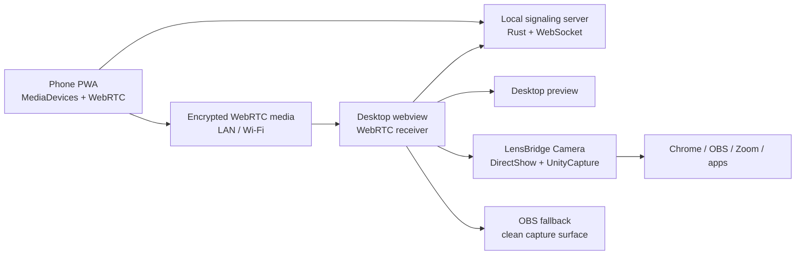

# LensBridge

**Bridge any camera source into any app.**

LensBridge is an open-source, local-first universal camera bridge. It turns a phone camera into a low-latency desktop video source through QR pairing, a local signaling server, WebRTC preview, and Windows DirectShow output through `LensBridge Camera`. OBS Output Mode remains available as a fallback.

> Current status: **V2 Windows bridge in progress**. Phone camera streaming to desktop preview is implemented. Windows DirectShow output is implemented with UnityCapture and a throttled WebView-to-Rust frame pump. macOS native output, AI filters, Bluetooth pairing, RTSP ingest, and plugin runtime loading are documented or scaffolded, not claimed as complete.

## Why It Exists

Many laptops ship with weak or missing webcams, while phones already have excellent cameras. Existing tools can be choppy, manual, closed, or hard to uninstall cleanly. LensBridge aims for a better open-source baseline:

- Scan a QR code instead of typing IP addresses.
- Keep video local by default.
- Use WebRTC for low-latency LAN streaming.
- Avoid accounts, tracking, telemetry, and cloud routing.
- Build a serious architecture that can grow beyond phones.
- Be honest about what works today and what is planned.

## V1 Features

- `@lensbridge/desktop`: Tauri v2 desktop shell with polished React UI.
- `@lensbridge/phone`: mobile-first PWA with camera preview and WebRTC sender.
- Local pairing sessions with random tokens and expiry.
- Local WebSocket signaling server scaffold in Rust.
- QR payload generation with fallback manual pairing details.
- Desktop WebRTC receiver architecture for in-app stream preview.
- Windows `LensBridge Camera` DirectShow output through the bundled UnityCapture filter.
- OBS Output Mode fallback for clean Window Capture with no sidebar, QR card, status bar, or app chrome.
- Shared TypeScript protocol and validation helpers.
- Honest virtual camera docs and Linux v4l2loopback scripts for V2 work.
- Source, transport, media, virtual camera, audio, AI, and plugin scaffolds.

## Architecture



LensBridge currently keeps WebRTC receiving in browser/WebView APIs. Rust owns pairing, local sessions, native capability checks, signaling, and the Windows UnityCapture shared-memory publisher.

## Quick Start

Requirements:

- Node.js 20+
- pnpm 9+
- Rust stable
- Tauri prerequisites for your OS

Install:

```bash
pnpm install
```

Run phone PWA:

```bash
pnpm --filter @lensbridge/phone dev
```

Run desktop app:

```bash
pnpm --filter @lensbridge/desktop tauri dev
```

Run all web dev tasks:

```bash
pnpm dev
```

Build:

```bash
pnpm build
```

Typecheck:

```bash
pnpm typecheck
```

Rust check:

```bash
pnpm check:rust
```

Windows DirectShow camera install:

```powershell
pnpm install:windows-camera
```

## Phone Usage

1. Start the desktop app.
2. Start the phone PWA with `pnpm --filter @lensbridge/phone dev -- --host 0.0.0.0`.
3. Scan the QR code shown by desktop, or open the manual pairing link.
4. Allow camera access.
5. Tap **Start stream**.
6. Desktop should show the phone camera preview when signaling and WebRTC negotiation complete.

## Use LensBridge As A Webcam On Windows

Primary Windows flow:

```text
Phone -> LensBridge Desktop -> LensBridge Camera -> browser/app
```

Steps:

1. Run PowerShell as Administrator.
2. Run `pnpm install:windows-camera`.
3. Restart Chrome or your meeting app.
4. Start LensBridge Desktop.
5. Connect your phone.
6. Choose **LensBridge Camera** in the target app.

Use `TEST-CAMERAS.html` to verify Chrome can see and open the camera without OBS.

OBS fallback:

```text
Phone -> LensBridge Desktop -> LensBridge OBS Output -> OBS Window Capture -> OBS Virtual Camera -> browser/app
```

Use OBS fallback if the DirectShow driver is not installed or the target app refuses virtual DirectShow devices.

## Virtual Camera Status

Windows V2 ships an experimental DirectShow camera bridge named `LensBridge Camera`.

- Windows today: `LensBridge Camera` DirectShow output, with OBS Output Mode as fallback.
- Linux native path: planned `v4l2loopback` plus FFmpeg/GStreamer pipeline.
- macOS CoreMediaIO output is a future roadmap item.

## Repository Layout

```text
apps/desktop        Tauri v2 desktop app
apps/phone          Phone PWA
apps/landing        Project landing page scaffold
packages/shared     Shared TypeScript types and validators
packages/protocol   Wire protocol documentation
packages/plugin-sdk Community plugin SDK types
drivers             OS-specific virtual camera docs and scripts
docs                Product, architecture, security, and setup docs
examples            Usage and plugin examples
```

## Security Model

- No accounts.
- No telemetry.
- No cloud routing by default.
- No recording or storage of video.
- Random session tokens with expiry.
- One active local pairing session by default.
- Future hardening includes TLS/mkcert, trusted devices, certificate pinning, and password-authenticated pairing.

Read [docs/security.md](docs/security.md) for the threat model.

## Roadmap

- **V1:** phone-to-desktop WebRTC preview.
- **V2:** Windows DirectShow camera bridge and OBS fallback reliability.
- **V3:** universal source expansion and native receiver performance work.
- **V4:** local AI processing and plugin runtime.

See [ROADMAP.md](ROADMAP.md).

## Contributing

LensBridge is MIT licensed and built for contributors. Start with [CONTRIBUTING.md](CONTRIBUTING.md), then read [docs/architecture.md](docs/architecture.md) and [docs/source-drivers.md](docs/source-drivers.md).

## License

MIT © 2026 Abhijeet Ranjan
