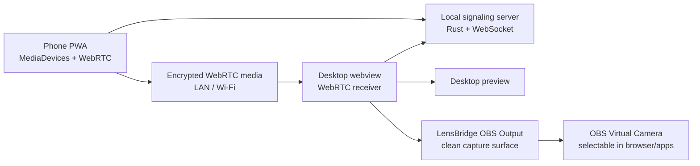

# LensBridge

**Bridge any camera source into any app.**

LensBridge is an open-source, local-first universal camera bridge. V1 turns a phone camera into a low-latency desktop video source through QR pairing, a local signaling server, WebRTC preview, and a capture-safe OBS output mode. Later versions expand the same architecture to native virtual camera drivers, other computers, IP cameras, OBS ingest, screen capture, and community source plugins.

> Current status: **V1 MVP in progress**. Phone camera streaming to desktop preview is implemented as the first real path. Virtual camera output, native Windows/macOS drivers, AI filters, Bluetooth pairing, RTSP ingest, and plugin runtime loading are documented or scaffolded, not claimed as complete.

## Why It Exists

Many laptops ship with weak or missing webcams, while phones already have excellent cameras. Existing tools can be choppy, manual, closed, or hard to uninstall cleanly. LensBridge aims for a better open-source baseline:

- Scan a QR code instead of typing IP addresses.
- Keep video local by default.
- Use WebRTC for low-latency LAN streaming.
- Avoid accounts, tracking, telemetry, and cloud routing.
- Build a serious architecture that can grow beyond phones.
- Be honest about what works today and what is planned.

## V1 Features

- `@lensbridge/desktop`: Tauri v2 desktop shell with polished React UI.
- `@lensbridge/phone`: mobile-first PWA with camera preview and WebRTC sender.
- Local pairing sessions with random tokens and expiry.
- Local WebSocket signaling server scaffold in Rust.
- QR payload generation with fallback manual pairing details.
- Desktop WebRTC receiver architecture for in-app stream preview.
- OBS Output Mode for clean Window Capture with no sidebar, QR card, status bar, or app chrome.
- Shared TypeScript protocol and validation helpers.
- Honest virtual camera docs and Linux v4l2loopback scripts for V2 work.
- Source, transport, media, virtual camera, audio, AI, and plugin scaffolds.

## Architecture



V1 keeps media handling in browser/WebView WebRTC APIs because that is the most practical path for a Tauri MVP. Rust owns pairing, local sessions, native capability checks, and the signaling server.

## Quick Start

Requirements:

- Node.js 20+
- pnpm 9+
- Rust stable
- Tauri prerequisites for your OS

Install:

```bash
pnpm install
```

Run phone PWA:

```bash
pnpm --filter @lensbridge/phone dev
```

Run desktop app:

```bash
pnpm --filter @lensbridge/desktop tauri dev
```

Run all web dev tasks:

```bash
pnpm dev
```

Build:

```bash
pnpm build
```

Typecheck:

```bash
pnpm typecheck
```

Rust check:

```bash
pnpm check:rust
```

Linux v4l2loopback setup for future native pipeline research:

```bash
cd drivers/linux
chmod +x setup-v4l2loopback.sh
./setup-v4l2loopback.sh
```

## Phone Usage

1. Start the desktop app.
2. Start the phone PWA with `pnpm --filter @lensbridge/phone dev -- --host 0.0.0.0`.
3. Scan the QR code shown by desktop, or open the manual pairing link.
4. Allow camera access.
5. Tap **Start stream**.
6. Desktop should show the phone camera preview when signaling and WebRTC negotiation complete.

## Use LensBridge As A Webcam Today With OBS

Current supported flow:

```text
Phone -> LensBridge Desktop -> LensBridge OBS Output -> OBS Window Capture -> OBS Virtual Camera -> browser/app
```

Why OBS is needed: Chrome, Zoom, Discord, Meet, and similar apps only see cameras registered by the operating system.
LensBridge currently creates the live local source. OBS Virtual Camera exposes that source as a selectable system camera.

Steps:

1. Connect your phone in LensBridge.
2. Click **Open OBS Output** in the desktop dashboard.
3. Open OBS Studio.
4. Add **Source -> Window Capture**.
5. Select **LensBridge OBS Output**.
   If OBS says **LensBridge Desktop**, go back and click **Open OBS Output** first.
6. If the OBS preview is black, try capture methods in this order: Windows Graphics Capture, Windows 10 1903 and up, then BitBlt.
7. Right-click the OBS source and choose **Transform -> Fit to Screen**.
8. Click **Start Virtual Camera** in OBS.
9. Refresh or restart Chrome.
10. In your browser or meeting app, choose **OBS Virtual Camera**.

Chrome will not show **LensBridge** until a native camera driver exists. Today it should show **OBS Virtual Camera** after
OBS starts its virtual camera.

## Virtual Camera Status

V1 does **not** claim a native virtual camera driver. Desktop preview and OBS Output Mode are the shipped workflows.

- Windows/macOS today: OBS Output Mode plus OBS Virtual Camera.
- Linux native path: planned `v4l2loopback` plus FFmpeg/GStreamer pipeline.
- Native Windows DirectShow and macOS CoreMediaIO drivers are future roadmap items.

## Repository Layout

```text
apps/desktop        Tauri v2 desktop app
apps/phone          Phone PWA
apps/landing        Project landing page scaffold
packages/shared     Shared TypeScript types and validators
packages/protocol   Wire protocol documentation
packages/plugin-sdk Community plugin SDK types
drivers             OS-specific virtual camera docs and scripts
docs                Product, architecture, security, and setup docs
examples            Usage and plugin examples
```

## Security Model

- No accounts.
- No telemetry.
- No cloud routing by default.
- No recording or storage of video.
- Random session tokens with expiry.
- One active local pairing session by default.
- Future hardening includes TLS/mkcert, trusted devices, certificate pinning, and password-authenticated pairing.

Read [docs/security.md](docs/security.md) for the threat model.

## Roadmap

- **V1:** phone-to-desktop WebRTC preview.
- **V2:** OBS Output Mode and reliability.
- **V3:** universal source expansion and native virtual camera research.
- **V4:** local AI processing and plugin runtime.

See [ROADMAP.md](ROADMAP.md).

## Contributing

LensBridge is MIT licensed and built for contributors. Start with [CONTRIBUTING.md](CONTRIBUTING.md), then read [docs/architecture.md](docs/architecture.md) and [docs/source-drivers.md](docs/source-drivers.md).

## License

MIT © 2026 Abhijeet Ranjan
