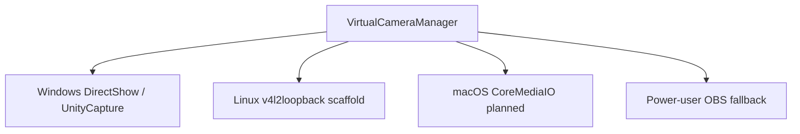

# Frame Pipeline

This document maps the current frame path and the extension points for future native receivers.

## Implemented Windows Path

## Capture Stage

The phone PWA owns camera permission and applies LensBridge quality profiles. The current supported profiles avoid wasteful 4K capture because the desktop output path is capped for 720p-class output.

## Desktop Preview Stage

The desktop receives a normal WebRTC `MediaStream`. Preview UI reads browser stats for FPS, bitrate, jitter, and basic resolution.

## Direct Camera Stage

`apps/desktop/src/hooks/useUnityCaptureBridge.ts` owns the active frame pump:

- Draws the latest WebRTC video frame into a fixed canvas.
- Reads RGBA bytes.
- Sends bytes to Rust through raw Tauri IPC.
- Drops stale frames when the transport is busy.
- Tracks dropped frames and send timing for benchmarks.

`apps/desktop/src-tauri/src/virtual_cam/unity_capture.rs` validates the frame and writes it into UnityCapture-compatible Windows shared-memory objects.

## Backend Abstraction

Only the Windows DirectShow path is currently implemented as a working native camera output. Linux and macOS must remain marked experimental/planned until frame output is verified.

## Benchmark Hooks

The frame pump records:

- Delivered frames.
- Dropped frames.
- Average send duration.
- p95 send duration.
- Rust write duration.

See [../BENCHMARKS.md](../BENCHMARKS.md).
