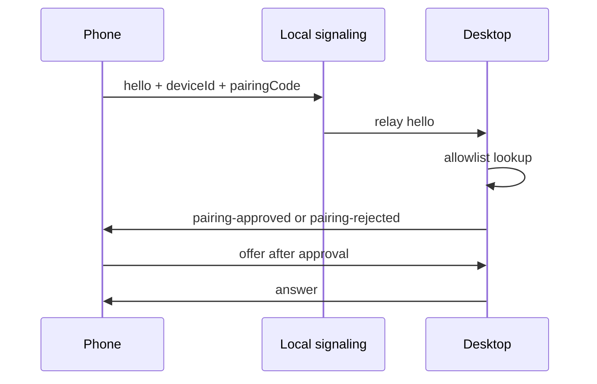

# Pairing Flow

1. Desktop creates a session ID and token.
2. Desktop displays a QR code containing a base64url pairing payload.
3. Phone decodes the payload and creates/loads a stable local device ID.
4. Phone connects to the local signaling server with `sessionId`, `token`, and `role=phone`.
5. Desktop webview connects with `role=desktop`.
6. The signaling server validates tokens and relays signaling messages.
7. Phone sends `hello` with device metadata and a short pairing code.
8. Desktop checks the trusted-device allowlist.
9. Unknown phones are shown in the desktop approval prompt.
10. The user approves once, trusts the device, or rejects the request.
11. Phone sends the WebRTC offer only after `pairing-approved`.
12. Desktop accepts phone media messages only when their `deviceId` matches the approved request.

If the QR/link expires before the phone reaches the server, regenerate the session and scan again. An already approved active stream is not intentionally stopped by the QR countdown.
