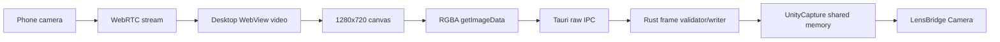

# Performance

LensBridge measures the current Windows frame path before claiming it is fast.

## Implemented Instrumentation

The desktop frame pump tracks:

- Delivered FPS.
- Total delivered frames.
- Dropped frames when a newer frame replaces an unsent frame.
- Average canvas-to-IPC send duration.
- p95 canvas-to-IPC send duration.
- Rust frame write duration reported by the Tauri command.

These values are shown in the Direct Windows Camera panel while `LensBridge Camera` is open in a consumer app.

## Current Pipeline



The active transport is latest-frame-wins:

- Capture keeps the newest available frame.
- Transport sends one frame at a time.
- If capture produces a newer frame before transport consumes the previous one, the previous frame is counted as dropped.
- Dropping stale frames is intentional because low latency matters more than delivering old frames.

## Benchmark Tooling

Use:

```powershell
pnpm benchmark:frame-pump
```

The script writes a machine-readable JSON template under `benchmarks/results/*.local.json`. Fill it using the metrics visible in the desktop app after each required run.

See [../BENCHMARKS.md](../BENCHMARKS.md) for the benchmark protocol and required scenarios.

## Known Limits

- The WebView canvas readback path still copies pixels.
- Rust receives RGBA bytes through Tauri IPC, not a native media texture.
- The current path is practical for Windows V2, but it is not a final native receiver.
- No committed benchmark currently proves 720p30 for 10 minutes on public hardware.

## Roadmap Impact

If benchmarks show missed 720p30 targets, native receiver work stays critical:

- Avoid WebView canvas readback where possible.
- Reduce memory copies.
- Keep frame timing visible in UI.
- Add platform-specific camera output tests.
