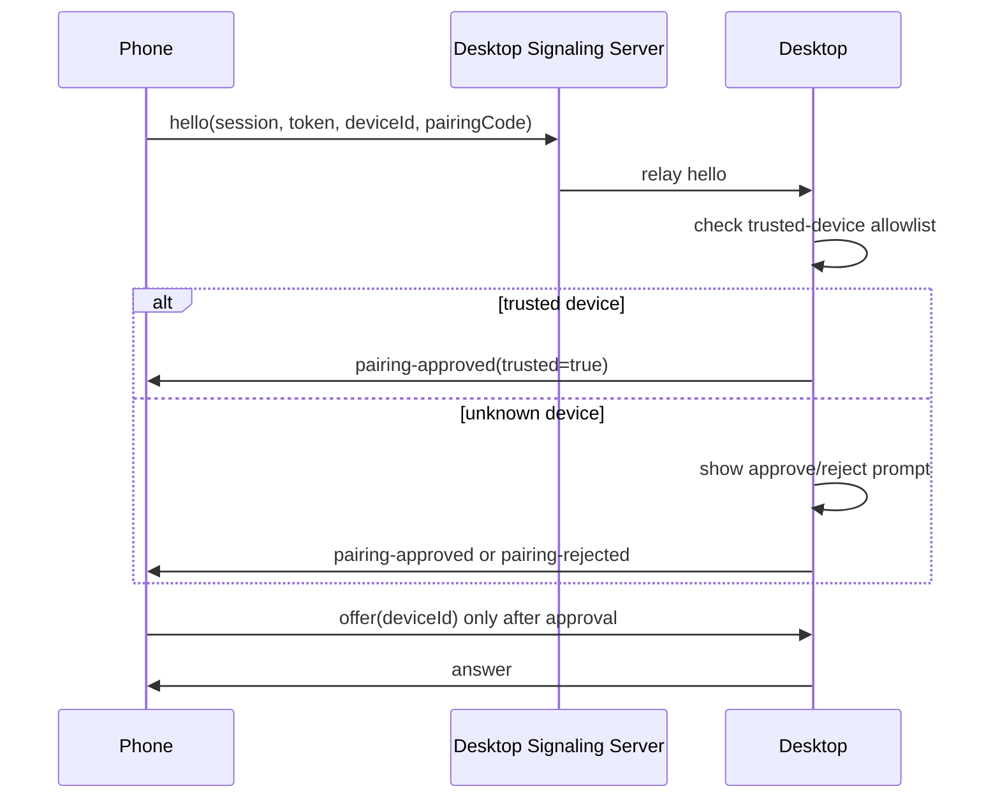

# Security Architecture

LensBridge is local-first, but local-first does not mean silently trusting every device on the LAN.

## Implemented Pairing Gate



Unknown phones cannot start WebRTC until the desktop approves them. The desktop also rejects `offer` messages that arrive before approval or do not match the approved phone device ID. Phone-side ICE candidates, metrics, and stream lifecycle messages are bound to the same approved device ID.

## Pairing Code

The phone and desktop display the same six-digit pairing code. It is derived from:

- session ID
- random session token
- phone device ID

The code is for human verification and does not replace the full random token.

## Trusted Devices

Trusted devices are stored locally in the desktop app data directory:

```text
trusted-devices.json
security-audit.json
```

The store records:

- stable phone device ID
- display label
- platform/user-agent hints
- short fingerprint
- trusted timestamp
- last-seen timestamp

The desktop Security page can revoke trusted devices. Corrupt allowlist files load as empty instead of silently trusting devices.

## Audit Events

The desktop records recent security events:

- pairing requested
- approved once
- trusted device added
- trusted device auto-approved
- trusted device revoked
- pairing rejected

## Current Transport Modes

Implemented:

- WebRTC media encryption through DTLS-SRTP.
- Local random session tokens with expiry.
- Explicit desktop approval for unknown devices.
- Local trusted-device allowlist.

Still limited:

- Development phone server and signaling may use HTTP/WS on a trusted LAN.
- Local TLS/mkcert mode is documented as planned/config-gated work, not a completed secure release path.
- Trusted-device identity currently uses a stable local phone ID, not an asymmetric key pair.

## Threat Model

LensBridge protects against accidental or opportunistic LAN joins when the QR/link leaks briefly. It does not yet claim hostile-network hardening equivalent to certificate-pinned production software.
